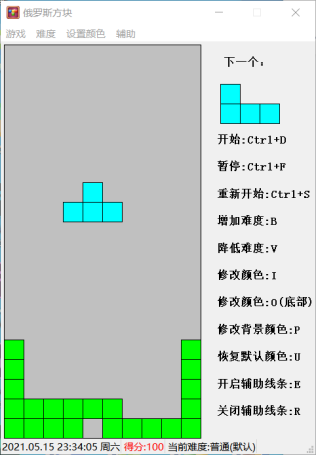
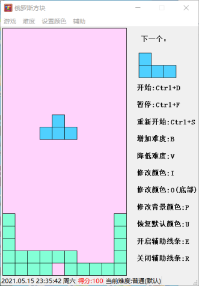
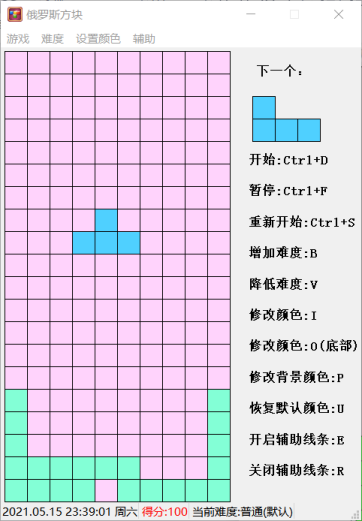

# QT实现完美的俄罗斯方块。
QT Homework
Date：2021 / 5 / 15
项目：
QT 俄罗斯方块小游戏。
### 实现功能：
            1.游戏开始、暂停、重开。
            2.难度设置。
            3.颜色设置、背景颜色设置。
            4.时间、分数、难度显示
            5.游戏辅助线条。
            6.快捷键。
            游戏完美没有任何BUG。
### 默认风格：

### 自定义风格：

### 开启辅助线条：

